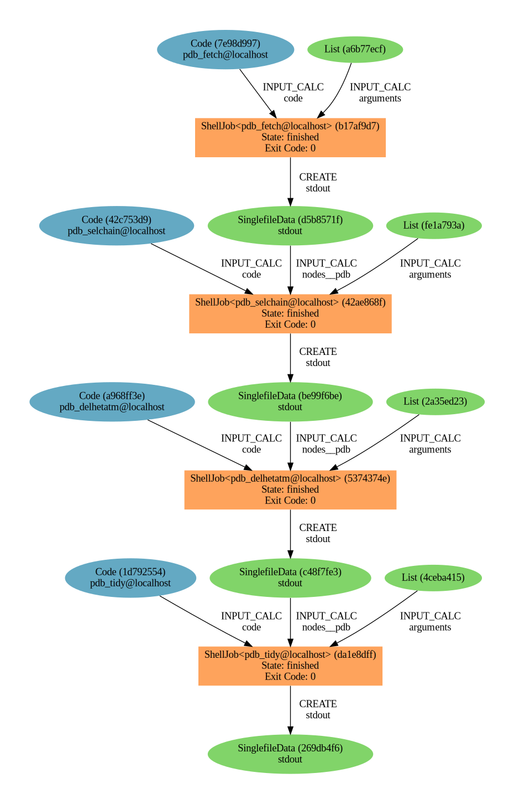

The ``aiida-shell`` package is an AiiDA plugin that makes running shell commands easy.
Run any shell executable without writing a dedicated plugin or parser.

============
Introduction
============

AiiDA is known for having a relatively high start-up cost, especially when the codes of interest do not yet have an existing plugin on the `plugin registry <https://aiidateam.github.io/aiida-registry/>`_.
Traditionally, one would then first have to invest time to write dedicated ``CalcJob`` and ``Parser`` plugins which is time consuming.
While writing dedicated plugins is valuable in the long run for well established codes, it makes prototyping in AiiDA unpractically time consuming.
Additionally, certain codes are so simple (e.g., basic shell commands or command line interface utilities) that writing dedicated plugins is overkill.

``aiida-shell`` is a package that makes it trivial to run any code with AiiDA without having to write explicit ``CalcJob`` and ``Parser`` plugins.
Since no plugins are required, ``aiida-shell`` also doesn't require entry points and so it is not necessary to write a full-blown Python package to work with AiiDA.
All of this significantly simplifies using AiiDA for new users or for existing users to start integrating new codes in their workflows.

----------------
Example showcase
----------------

To show ``aiida-shell`` in action and demonstrate how it simplifies integrating new codes with AiiDA, consider the following example.
The `pdb-tools <http://www.bonvinlab.org/pdb-tools/>`_ package provides a number of CLI tools to manipulate and edit `PDB files <https://en.wikipedia.org/wiki/Protein_Data_Bank_(file_format)>`_.
Typical use cases will call multiple tools in sequence, piping the output from one tool into the other:

.. code:: console

    pdb_fetch 1brs | pdb_selchain -A,D | pdb_delhetatm | pdb_tidy > 1brs_AD_noHET.pdb

The example above downloads a protein called ``1brs`` and passes it through a number of tools to clean it.
If one wanted to run this workflow in AiiDA, one would have to write plugins for each individual tool.
With ``aiida-shell``, this exact pipeline can be run through AiiDA with the following script:

.. code:: python

    #!/usr/bin/env runaiida
    """Simple ``aiida-shell`` script to manipulate a protein defined by a .pdb file.

    Just requires a configured AiiDA profile and ``pdb-tools`` to be installed.
    """
    from aiida_shell import launch_shell_job

    results, node = launch_shell_job('pdb_fetch', '1brs')
    results, node = launch_shell_job('pdb_selchain', '-A,D {pdb}', {'pdb': results['stdout']})
    results, node = launch_shell_job('pdb_delhetatm', '{pdb}', {'pdb': results['stdout']})
    results, node = launch_shell_job('pdb_tidy', '{pdb}', {'pdb': results['stdout']})

    print(f'Final pdb: {node}')
    print(f'Show the content using `verdi node repo cat {node.pk} pdb`')
    print(f'Generate the provenance graph with `verdi node graph generate {node.pk}`')

The image generated by ``verdi node graph generate`` of the final PDB node looks as follows:

The entire provenance of the four chained tools was captured perfectly without ever having to write a plugin, configure a code or computer, or even explicitly create a ``Node``.
To start using ``aiida-shell``, head on over to the :ref:`installation instructions <installation>` and the :ref:`how-to guides <how-to>`.

-----------
How to cite
-----------

Please refer to the `CITATION.cff <https://github.com/sphuber/aiida-shell/blob/master/CITATION.cff>`_ file.

.. toctree::
   :maxdepth: 1
   :hidden:

   installation
   howto
   examples
   changelog
